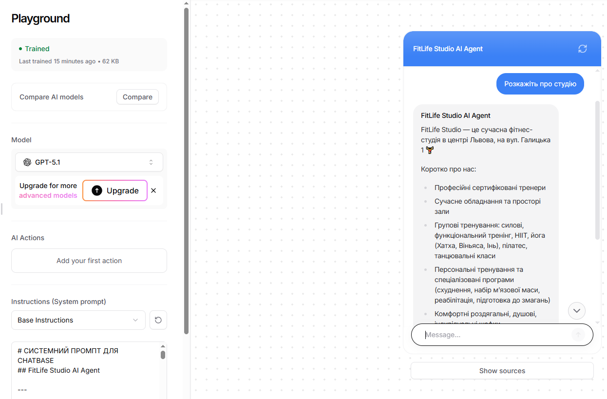

# FitLife Studio – Chatbase AI Agent

## Overview
This case demonstrates a **business-oriented AI agent built on Chatbase** for a fitness studio.

The agent is designed to:
- Answer customer questions using uploaded knowledge
- Collect leads and contact data
- Drive users toward booking a **free trial session** (primary KPI)
- Safely handle edge cases and handoff to a human administrator

## Platform
- **Tool:** Chatbase
- **LLM:** GPT-style model
- **Knowledge Sources:**
    - Website links
    - Business description
    - Structured Q&A
    - Custom system prompt

## Primary Business Goal
**Convert conversations into free trial session bookings.**

Secondary goals:
- Reduce administrator workload
- Provide consistent customer support
- Collect structured lead data

## Agent Design Highlights
- Clear primary objective hierarchy
- Button- and intent-driven flows
- Strict safety and compliance rules
- Explicit human handoff logic
- Platform-aware behavior (Chatbase Q&A priority, confidence handling)
- KPI-oriented dialog design

## Key Flows
- Free trial booking (name → phone → workout type)
- Pricing and membership information
- Beginner support and motivation
- Callback request handling
- Off-hours behavior
- Escalation to administrator

## Prompt Design

see : [directive.md](./instructions/custom_prompt.md)

## Why This Case Matters
This project demonstrates how to design **production-ready AI agents** for real businesses, taking into account:
- Platform constraints
- Automation reliability
- Safety boundaries
- Conversion-focused UX

It goes beyond prompt writing and shows **AI product design thinking**.