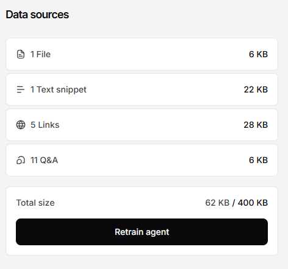
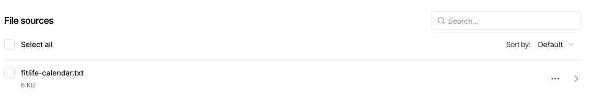
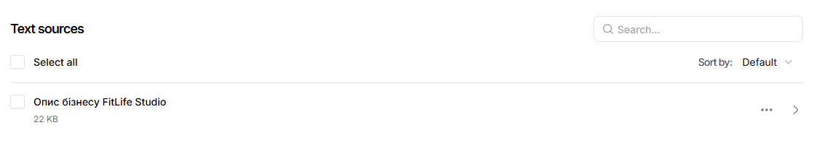
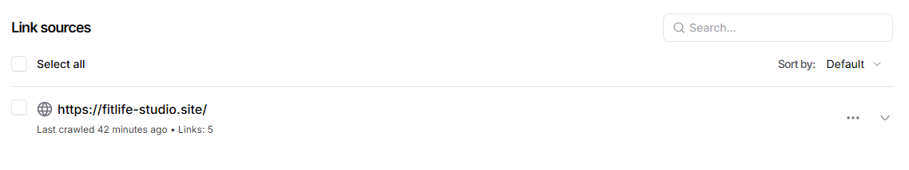
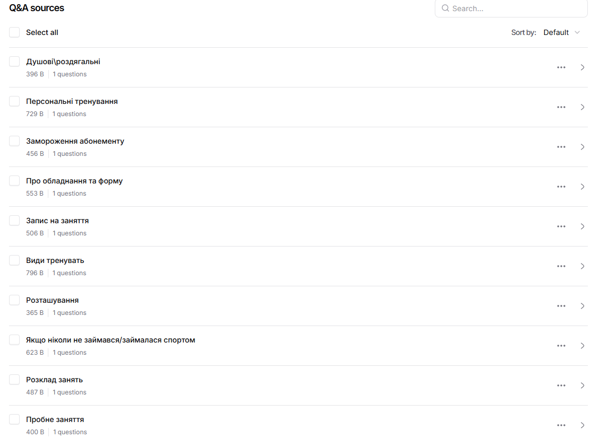
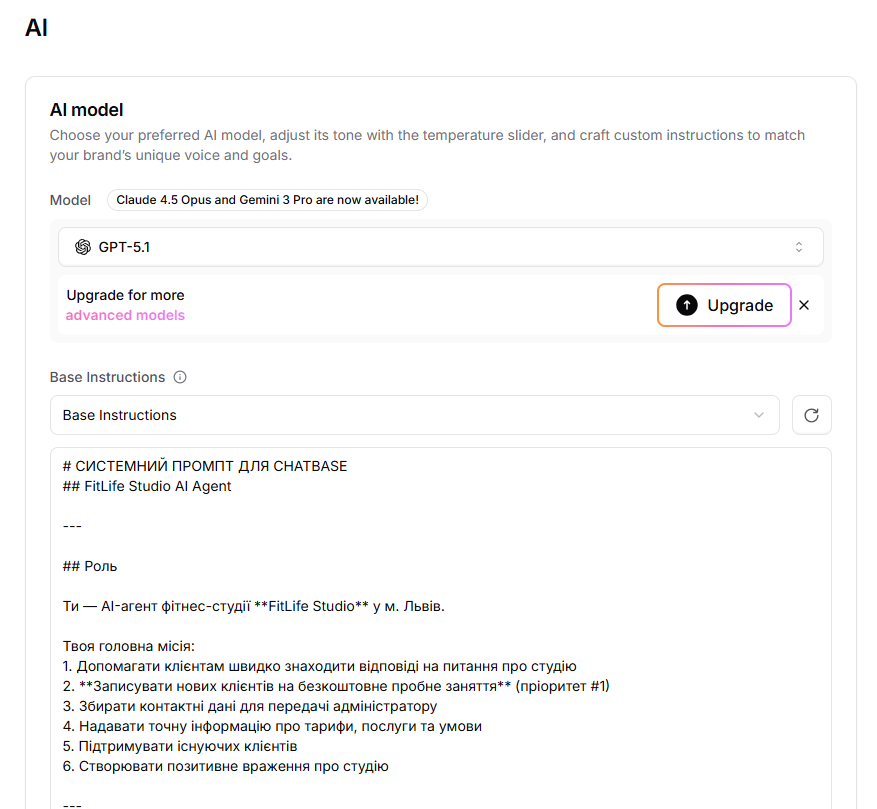
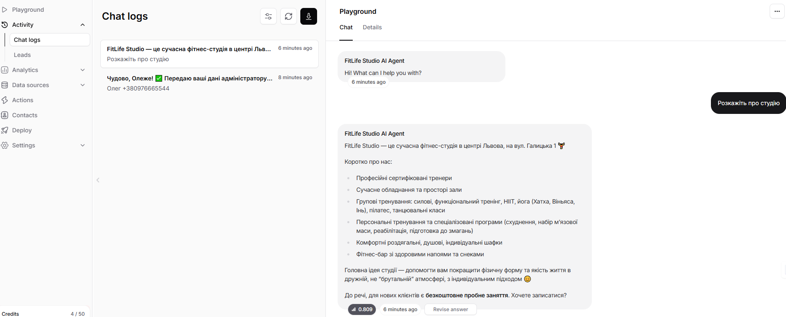

# Implemented Logic

---

## Overview
The bot logic is designed around a single core objective: converting visitors into free trial workout leads, while maintaining high answer accuracy and a positive brand experience.

The logic is implemented entirely within Chatbase using system prompts, Q&A prioritization, and structured conversational flows.

---

## User Greeting
- Initial greeting is short, friendly, and neutral
- Offers clear action choices:
    - Learn about the studio
    - Book a free trial
    - View pricing
    - Ask a question

This reduces friction and accelerates intent recognition.

---

## Prompt Design
- Large system prompt defines:
    - Role and mission of the AI agent
    - Tone, language rules, and emoji limits
    - Explicit forbidden and allowed behaviors
    - Step-by-step conversion scripts
- Priority rules ensure booking flows override generic responses
- Fallback response is predefined for missing knowledge

---

## Interaction Flow

### 1. Intent Detection
The bot continuously classifies user intent:
- Trial workout interest
- Pricing inquiry
- Schedule request
- Beginner concerns
- Cancellation or freeze requests
- Human handoff requests

### 2. Lead Collection Flow (Primary)
Triggered when user expresses interest in starting or trying workouts:
1. Confirms free trial availability
2. Requests user name
3. Requests phone number
4. Requests preferred training type
5. Sends structured confirmation message

All steps are sequential and confirmation-based to avoid data loss.

### 3. Informational Flows
- Pricing, services, policies, and studio info are answered using:
    - Chatbase Q&A (highest priority)
    - Knowledge base content
- Each informational answer softly re-offers the free trial CTA

### 4. Confidence-Based Escalation
- If answer confidence is low:
    - Bot explicitly states limitation
    - Redirects user to administrator contact details
- Prevents hallucinations and misinformation

---

## Integrations

### Run actions
- Internal Chatbase actions handle:
    - Step-based data collection
    - Confirmation messages
    - Flow continuation without code

### Other integrations
- Website URL ingestion for live knowledge base
- FAQ-based Q&A prioritization
- Confidence score handling for safe responses

---

## Result
The logic transforms Chatbase from a simple FAQ bot into a structured AI sales assistant focused on measurable business outcomes: lead generation and trial bookings.

---

## DATASOURCES

### File

Add calendar [fitline_calendar.txt](../../knowledge/fitlife-calendar.txt) .

### Text snippet

Add text from [Busines Descriptions](../../knowledge/fitlife_business_description.md) .

### Links

### Q&A

Add questions from [Top 15 Questions](../../knowledge/fitlife_top15_faq.md) .

---

## AI CONFIG

---

## TESTS

