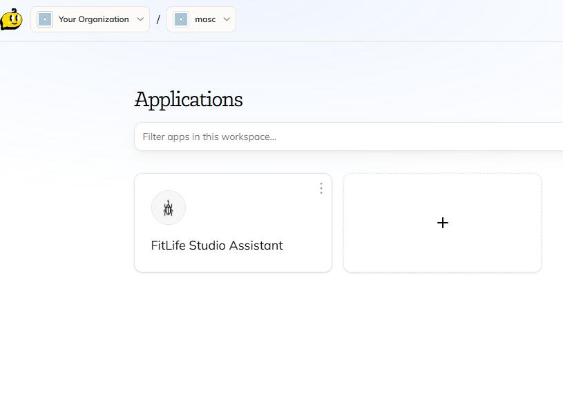

# FitLife Studio Assistant

AI Business Chatbot on Chipp.AI 

---

## Overview
FitLife Studio Assistant is an AI-powered virtual consultant designed to support both new and existing clients of a fitness studio. The chatbot operates 24/7, providing instant responses about studio services, memberships, trial sessions, and general inquiries, while also facilitating direct contact with a human manager when needed.

---

## Business context
FitLife Studio needed a scalable digital assistant to reduce the workload on administrators, improve lead handling, and ensure clients receive immediate and consistent information outside of working hours. The chatbot serves as the first point of contact and helps convert website visitors into qualified leads.

---

## Platform
* **Industry**: Fitness & Wellness
* **Platform**: Chipp AI
* **Primary Business Goal**: Lead generation and client onboarding
* **Secondary Goals**:
    - Automate answers to frequently asked questions
    - Increase trial session sign-ups
    - Improve client communication availability (24/7)

---

## Implemented Logic

see : [README.md](./logic/README.md)

---

## Assistant Scope

### Assistant Role
The assistant acts as a virtual studio consultant:
- Informs users about services, pricing, and schedules
- Encourages users to book a free trial session
- Collects contact details for follow-up
- Redirects users to a human manager when requested

### Style Guidelines
- Friendly, welcoming, and motivating tone
- Clear and concise answers
- Use of emojis to maintain a warm, conversational feel
- Ukrainian language for end-user communication

### Safety & Business Rules
- Includes an AI disclaimer about potential inaccuracies
- Does not provide medical advice
- Always offers a way to contact a human representative

---

## Key Skills Demonstrated
- AI chatbot configuration and deployment
- Prompt engineering for customer support scenarios
- Knowledge base integration (FAQ, business description, schedule files)
- UX design using predefined conversation buttons

---

## Why This Case Matters
This project demonstrates how a no-code AI platform can be effectively used to automate customer support and lead generation for small businesses, improving response time and operational efficiency without increasing staff workload.

---

## Possible Extensions
- Integration with CRM systems
- Automatic booking confirmation and calendar sync
- Personalized fitness recommendations based on user goals
- Analytics dashboard for conversation insights  
