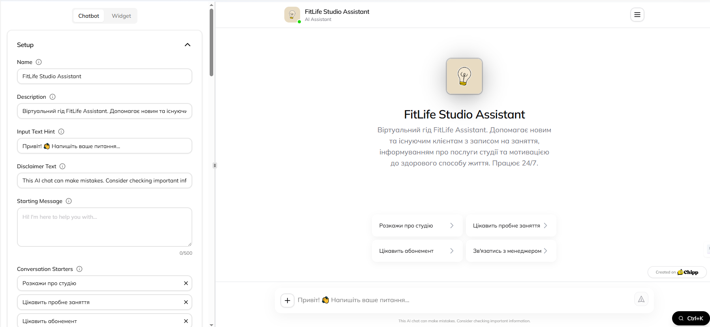
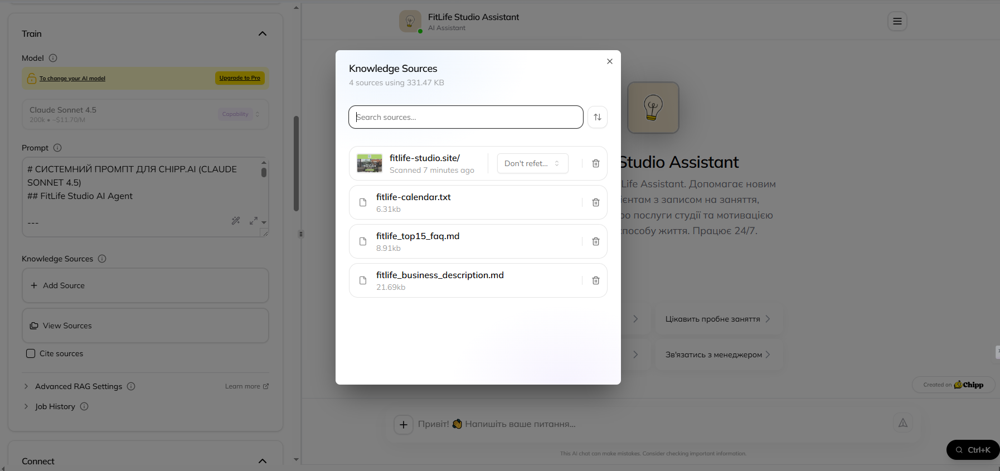
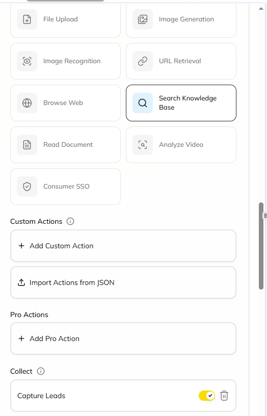

# Implemented Logic

## Overview
The chatbot logic is designed to guide users through a structured yet flexible conversation flow, ensuring fast access to key information while capturing leads and escalating requests to human staff when necessary.

---

## User Greeting
The conversation starts with a welcoming message introducing the AI assistant, its capabilities, and available options. Users are immediately informed about:
- Free trial session booking
- Studio services and memberships
- Alternative contact options (phone, email, Google Form)

see : [greeting.md](../instructions/greeting.md)

---

## Prompt Design
The core prompt positions the assistant as a helpful AI consultant for FitLife Studio. It clearly defines:
- The assistant’s role and responsibilities
- Supported topics (trial sessions, pricing, studio info)
- External knowledge sources (website and uploaded files)

see : [prompt.md](../instructions/prompt.md)

---

## Interaction Flow
1. User enters the chat and receives a greeting message
2. User selects a predefined button or types a free-form question
3. The assistant:
    - Answers questions using the knowledge base
    - Encourages trial bookings or membership inquiries
4. If the user requests human contact, the assistant provides direct contact details or a lead form link

---

## Integrations

### Run actions
- Display predefined conversation buttons
- Share external links (Google Form, website)
```text
https://forms.gle/TbruTLLnXS5ZZxzS9
```

### Collect leads
- Users are redirected to a Google Form to submit their name and contact information for follow-up

### Display buttons
Conversation starter buttons include:
- “Tell me about the studio”
- “I’m interested in a trial session”
- “I’m interested in a membership”
- “Contact a manager”

### Other integrations
- Knowledge base connected via website content and uploaded files (FAQ, schedule, business description)  

---

## Logic

### Config



### Train



### Connect




