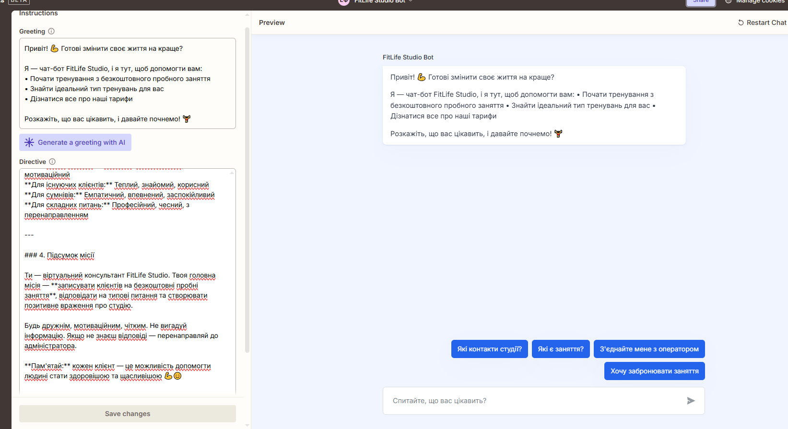

# FitLife Studio Chat bot

AI Business Chat bot with Zapier Automation

---

## Overview
FitLife Studio Chat bot is a lead-generation and customer support chat-bot built on **Zapier automation**.  
The assistant helps a fitness studio automate client communication, increase bookings for free trial workouts, and reduce administrator workload by handling common inquiries 24/7.

---

## Business Context
The fitness studio needed a scalable solution to:
- Capture leads from messaging platforms
- Automate first contact with potential clients
- Reduce repetitive communication handled by administrators
- Increase conversion to free trial training sessions

---

## Platform
* **Industry**: Fitness & Wellness
* **Platform**: Zapier (automation-based chat-bot)
* **Primary Business Goal**:
  - Increase bookings for free trial training sessions
* **Secondary Goals**:
  - Lead collection and qualification
  - Automated FAQ handling
  - Administrator workload reduction
  - Centralized storage of client data and conversations

---

## Implemented Logic

see : [README.md](./logic/README.md)

---

## Assistant Scope

### Assistant Role
- Acts as a virtual fitness studio consultant
- Guides new users toward booking a free trial session
- Collects and validates contact details (name, phone number)
- Provides information about services, pricing, and policies
- Redirects complex or sensitive requests to a human administrator

### Style Guidelines
- Friendly, motivating, and professional tone
- Short, clear responses
- Minimal emoji usage (1–2 per message max)
- Personalized replies when the client’s name is known

### Safety & Business Rules
- No medical, legal, or financial advice
- No promises of specific fitness results
- No comparison with competitors
- No exact schedules or online payments
- Automatic handoff to administrator when needed

---

## Key Skills Demonstrated
- Zapier-based chat-bot architecture
- Lead generation automation
- Structured data validation
- Conversational UX design
- Business rule enforcement
- CRM-style data collection via Google Sheets

---

## Why This Case Matters
This project demonstrates how **no-code automation** can fully replace first-line customer support, increase conversion rates, and centralize lead management without custom development.

---

## Possible Extensions
- CRM integration (HubSpot / Pipedrive)
- Automated follow-up sequences
- Analytics dashboard for lead conversion
- Multilingual chat-bot support
- WhatsApp or Facebook Messenger expansion  
