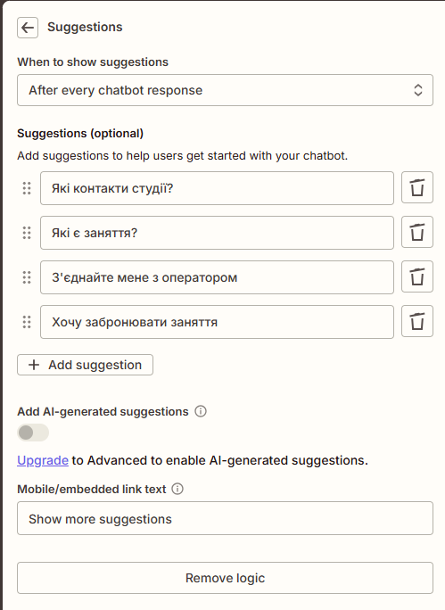
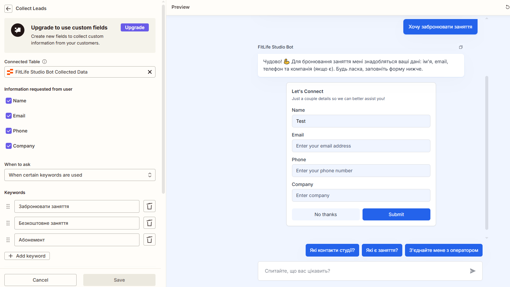
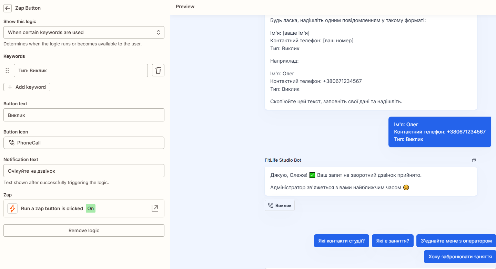

# Implemented Logic

## Overview
The chatbot logic is designed around **lead generation**, **structured data collection**, and **automated administrator notifications**, implemented entirely via Zapier workflows.

---

## User Greeting

- Automated welcome message introduces the bot
- Explains key benefits:
    - Free trial training
    - Available workout types
    - Pricing information
- Encourages user interaction via predefined buttons

see : [greeting.md](../instructions/greeting.md)

---

## Prompt Design

- System prompt defines:
    - Business role (fitness studio assistant)
    - Clear communication style rules
    - Safety and compliance restrictions
    - Primary KPI: booking free trial sessions
- Strict instruction hierarchy to avoid hallucinations
- Controlled handoff rules to administrator

see : [directive.md](../instructions/directive.md)

---

## Core Conversion Flow (Free Trial Session)

```text
[ User expresses interest ]
        ↓
[ Confirm availability of free trial ]
        ↓
[ Collect name ]
        ↓
[ Collect phone number ]
        ↓
[ Ask preferred workout type ]
        ↓
[ Confirm data ]
        ↓
[ Notify administrator ]
        ↓
[ Save lead to Google Sheets ]
```

The administrator contacts the client to finalize scheduling.

## Integrations

## Administrator Notifications

When a lead is created, Zapier sends an email to the administrator containing:

* Client name
* Phone number
* Request type
* Instruction to contact the client

This ensures zero lead loss.

### Run Actions
- Zapier triggers on structured user input
- Conditional paths:
    - Free trial booking
    - Callback request
    - General inquiry
- Error handling for incomplete or unstructured input

### Collect Leads
- All leads stored in **Google Sheets**
- Stored fields:
    - Date & time
    - Client name
    - Phone number
    - Request type
    - Status (New lead)
    - Source (Instagram / Telegram / Website)
  
### Interaction Options (Predefined Buttons)

Users can interact via predefined dialog buttons, such as:

* Book a free trial session
* Learn about the studio
* View pricing
* Request a callback

### Other Integrations
- Conversation transcription automatically saved to Google Sheets
- Full chat history available for administrator review
- Enables quality control and sales analysis

---

## Resulting Automation Value
- 24/7 lead capture
- Zero manual data entry
- Faster response time
- Improved client experience
- Scalable without additional staff

---

## ZAPS

### Suggestions



### Collect Leads



see : [collect_leads.md](./collect_leads.md)

### Run Zap (at the end of conversation)


see : [run_zap.md](./run_zap.md)

### Zap button



see : [zap_button.md](./zap_button.md)