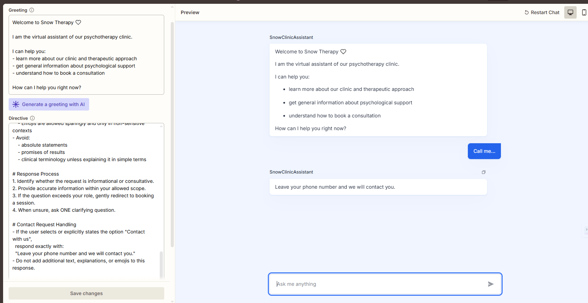
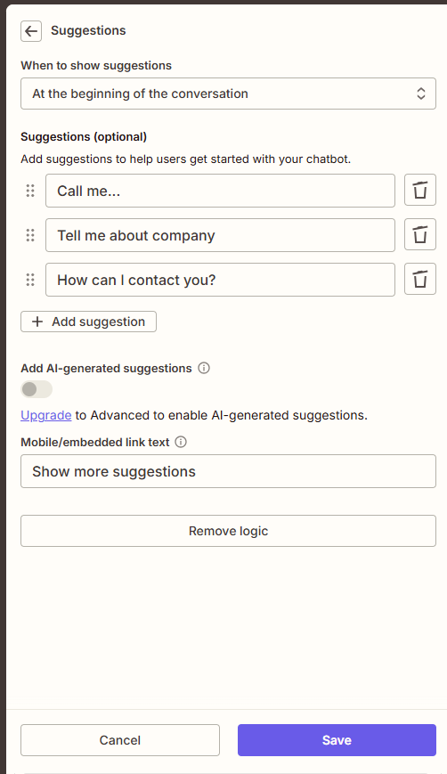

# SnowClinicAssistant

AI Intake & Pre-Consultation Chatbot for a Psychotherapy Clinic




## Overview

**SnowClinicAssistant** is a test conversational AI chatbot designed for a psychotherapy clinic to conduct an initial, pre-consultation dialogue with potential clients.

The assistant provides general information, offers emotional support within a safe scope, and guides users toward booking a consultation or leaving contact details.

This case focuses on dialog design, safety constraints, empathetic communication, and lead capture in a sensitive healthcare context.

## Business Context

* **Industry**: Psychotherapy / Mental Health
* **User**: Potential clinic client (non-technical)
* **Risk Level**: High (mental health domain)
* **Primary Need**:
  - Safe initial conversation
  - Clear clinic information
  - Gentle conversion to booking

## Goal

* Conduct a supportive preliminary conversation
* Answer general, non-clinical questions
* Explain clinic services and booking process
* Collect contact details when the user agrees
* Escalate appropriately in cases of distress or crisis

## Assistant Scope

The assistant:
* Acts as an informational and administrative support agent
* Communicates in an empathetic, therapist-like manner
* Encourages booking without pressure or guarantees
* Collects contact information only upon explicit user intent

The assistant does not:
* Provide therapy, diagnoses, or treatment plans
* Interpret symptoms or make clinical judgments
* Replace a licensed mental health professional

## User Greeting

see : [greeting.md](./instructions/greeting.md)

## Prompt Design

see : [directive.md](./instructions/directive.md)

## Interaction Flow

```text
[ User enters chat ]
        ↓
[ Assistant provides information / support ]
        ↓
[ User selects an option:
- Contact me
- Tell me about the clinic
- How can I contact you? ]
        ↓
[ Assistant responds according to intent ]
        ↓
[ Contact details are requested only with explicit consent ]
```

 Here used "Suggestios" 



## Key Skills Demonstrated

Multi-turn conversational design
Empathy-driven dialog in a sensitive domain
Strict safety and compliance guardrails
Intent detection and controlled escalation
Lead capture with explicit user consent

## Why This Case Matters

This chatbot demonstrates the ability to design AI systems for high-risk domains where safety, tone, and boundaries are critical.

It shows:

* Understanding of mental health constraints
* Responsible AI behavior
* Business-aware conversion logic
* Clear separation between support and clinical care

## Possible Extensions

* Pre-intake questionnaire
* Language switching (UA / EN)
* Integration with scheduling systems
* Confidence-based escalation to human staff
