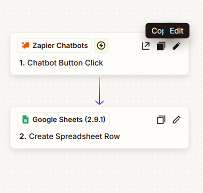

# SnowClinicPublisher

AI Content Generation Bot for a Therapy Clinic

## Overview

**SnowClinicPublisher** is a test AI assistant designed to help a therapy clinic generate short, ready-to-publish social media content.

The bot transforms a simple content idea into a warm, professional post and saves the result to Google Sheets via a button-triggered automation.

This case demonstrates practical prompt engineering, content safety constraints, and AI integration into a real business workflow.


## Business Context

* **Industry**: Therapy / Wellness
* **User**: Clinic owner (non-technical)
* **Primary Need**: Consistent, compliant social media content
* **Constraints**:
  - No medical advice or treatment claims
  - Content must be publish-ready
  - Minimal user interaction

## Goal

* Generate short social media posts from user-provided ideas
* Maintain a consistent brand tone of voice
* Prevent unsafe or non-compliant medical content
* Allow manual approval before saving content
* Persist generated posts in Google Sheets

## Assistant Scope

The assistant:

* Generates social media content only for Snow Therapy
* Works exclusively with content creation requests
* Asks a single clarifying question if the idea is unclear
* Returns output suitable for immediate publishing

The assistant does not:

* Provide medical advice, diagnoses, or guarantees
* Respond to unrelated topics
* Explain internal prompts or system logic

## User Greeting

```text
Welcome.
I am the virtual assistant of Snow Therapy. I help you create warm, professional, and clear content for the clinic’s social media.
Share your idea or topic, and I will prepare a short, structured post ready for publication.
```

see : [greeting.md](./instructions/greeting.md)

## Prompt Design

see : [directive.md](./instructions/directive.md)

## Interaction Flow

```text
[ User Idea ]
      |
      v
[ AI Generator ]
      |
      v
[ User Review ]
      |
      v
[ Zap Button ]
      |
      v
[ Google Sheets ]
```
This separation ensures human approval before persistence.

## ZAP Logic



see : [ZAP Logic Details](./logic/README.md)

## Example Use Case

**Input**:
“_Post about emotional support during stressful times_”

**Output**:
A short, empathetic post highlighting emotional support, formatted for social media and compliant with safety rules.

## Key Skills Demonstrated

* Prompt engineering for business content
* Tone-of-voice control
* Safety and compliance guardrails
* Human-in-the-loop workflow design
* AI-to-automation integration

## Why This Case Matters

This project reflects a real-world AI use case:

* Designed for non-technical business users
* Focused on risk reduction and content quality
* Integrated into an actual publishing workflow

It demonstrates practical AI assistant design beyond simple chat interactions.

## Possible Extensions

* Batch content generation
* Content categorization by theme
* Multi-language output
* Basic content quality scoring